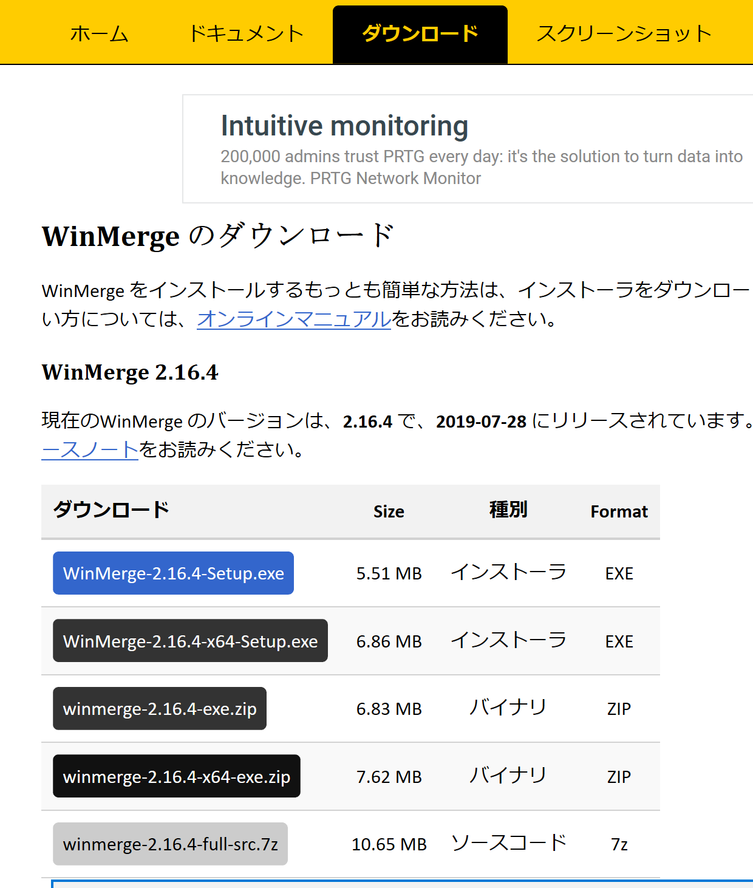
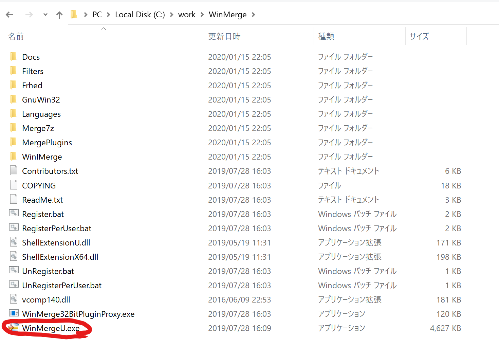
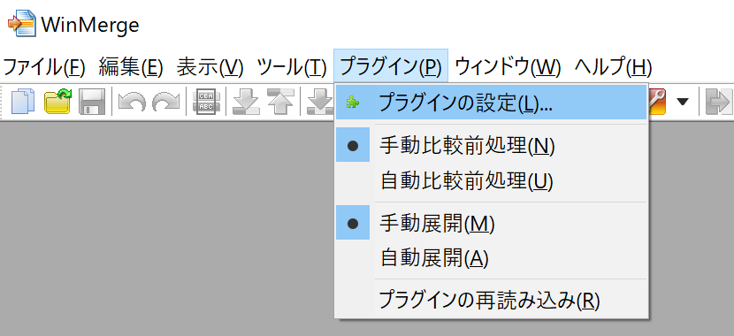

# Gitの使い方
## 初期設定
1. 現在の作業フォルダを確認する
    ```
    pwd
    ```
1. 現在のフォルダをGitでバージョン管理する
    ```
    git init
    ```
1. Git管理除外ファイルを作成する
    ```
    touch .gitignore
    ```
1. Vimを起動して、ファイルを開く
    ```
    vim .gitignore
    ```
1. 除外対象を入力する
    ```
    ファイル名/
    ```
1. コマンド入力モードに切り替え
    ```
    Escキー
    ```
1. ファイルを保存してVimを終了する
    ```
    :wq
    ```
1. Git管理の対象に、除外するもの以外全てを追加する([※1](#※１：改行コードを変換する旨、警告された場合))
    ```
    git add .
    ```
1. コミットする（追加を確定する）
    ```
    git commit -m "初めてのコミット"
    ```
---
## ※１：[改行コード](./help-common.md#改行コード)を変換する旨、警告された場合
- 警告メッセージ
    ```
    warning: CRLF will be replaced by LF in {ファイル名}.
    The file will have its original line endings in your working directory
    ```
- 対応方法
    - 変換は、想定通りのため警告を無視してOK

    - 変換をしないように設定したい場合は、以下のコマンドを実行
        ```
        git config --global core.autoCRLF false
        ```
# コマンド一覧
|コマンド|オプション|説明|
|:--|:--|:--|
|config||Git設定|
|config|-l|Git設定の確認|
# コマンド一覧(用途別)
- Gitで日本語を表示する
    ```
    git config --local core.quotepath false
    ```
- Git-GUIの文字コードをUTF-8に変更する（文字化け対策）
    ```
    git config --local gui.encoding utf-8
    ```
- すでにaddしているものをバージョン管理から対象外にする
    ```
    git rm --cached {ファイル名}
    ```
# Gitの設定をする(.gitconfig)
Gitの設定ファイルは3種類ある。
|種類|対象範囲|場所|備考|
|:--|:--|:--|:--|
|system|システム全体（全ユーザーの全リポジトリ）|/etc/gitconfig|-|
|global|該当ユーザーの全リポジトリ|~/.gitconfig|ホーム直下|
|local|該当リポジトリ|repository/.git/config|リポジトリの.git直下|

- リポジトリごとのGitの設定を確認する
    ```
    git config --local -l
    ```
- ユーザごとのGitの設定を確認する
    ```
    git config --global -l
    ```
- システム全体のGitの設定を確認する
    ```
    git config --system -l
    ```
# バージョン管理対象外にする(.gitignore)
## .gitignoreの設定
1. .gitignoreを作成し、書式に従って記述する
    ```
    cd {Gitフォルダパス}
    vim .gitignore
    i
    ```
    - 書式
        - ハッシュ記号で始まる行はコメントとして扱われる
        - 空行は無視される
        - ! マークで始まる行は残りのパターンを否定します
        - スラッシュ/で終わる場合はディレクトリのみを表す
        - スラッシュ/で始まる場合はルートディレクトリからを表す
        - どこにもスラッシュ/が無い場合はシェルのglobパターンとしてファイル名のベース部分にマッチするか検査される
        - 複数マッチするパターンがある場合は最後にマッチするものが優先される
    - 記入例
        |例|説明|
        |:--|:--|
        |*~|ファイル名の最後に ~ がある全てのファイル 例) index.html~ 等|
        |*.[ao]|拡張子が a 又は o のファイル 例) hello.a foo.o|
        |t/|t ディレクトリは全て無視されます|
        |v|ファイル名が v の場合無視されるが v がディレクトリ名の場合は無視されません|
        |!*.t|拡張子 t を持つファイルは無視されません|
1. .gitignoreを保存して閉じる
    ```
    ESC
    :wq
    ```
## .gitignoreで指定する前にgit addしてしまった場合
- 管理対象から削除され同時にファイルも削除
    ```
    git rm -f foo.html~
    ```
- 管理対象(インデックス)から削除するだけでファイルはそのまま
    ```
    git rm --cached foo.html~
    ```
- 管理対象(インデックス)から削除するだけでファイルはそのまま（フォルダ内を再帰的に）
    ```
    git rm --cached -r フォルダ名
    ```
# 空のフォルダをバージョン管理対象にする(.gitkeep)
# ブランチモデルを利用する(git-flow)
## 概要
git-flowは、正確にいうと Vincent Driessen 氏が提唱する「A successful Git branching model」というブランチモデルをサポートするツール（コマンド）の名称です。
一般的には、モデルとツールのどちらの名称としても使われています。git-flowでは、役割が決められた5種類（場合によっては6種類）のブランチを切り替えながら開発を進めていきます。
ブランチの作成やマージに決まりを設けることで、複数人での開発時にもブランチをわかりやすい状態に保つことができ、不用意なマージによる問題を避けることが可能です。
次に、git-flowにおけるブランチの種類をみていきましょう。
## git-flowで定義されている6種類のブランチ
いきなりチュートリアルに入ってしまうと、なにをやっているのかよくわからないと思いますので、ここでgit-flowで定義されている6種類のブランチについてざっと理解しておきましょう。なお、ここで説明しているブランチ操作は、ツールによって自動的に行われます。なにが起こっているのか把握できるようにしておきましょう。
- masterブランチ\
    master ブランチは、Gitでリポジトリを新規作成するとデフォルトで作成されるブランチですね。初心者の中には、masterブランチに直接コミットしている方も多いでしょう。それはそれで正しい使い方なのですが、git-flowでは master ブランチに直接コミットすることはなく、マージを行うだけのブランチになります。誤って直接コミットしてしまわないように注意しましょう。

- developブランチ\
    develop ブランチは、開発の中心となるブランチです。開発中は develop ブランチからブランチを切って、作業完了後に再びマージするという作業を繰り返すことになります。master ブランチ同様、直接このブランチにコミットすることはないので注意しましょう。リポジトリを新規作成したときに、master ブランチから develop ブランチを切っておきます。

- featureブランチ\
    feature ブランチは、機能の追加や変更、バグフィックスを行うブランチです。ひとつの変更に対してひとつの feature ブランチを切ることになるため、開発中で最も使われるブランチになるでしょう。ブランチの名前は、変更の内容がすぐに分かるような名称にしなければなりません。develop ブランチから派生させ、作業完了後に再び develop ブランチにマージします。そして、マージ完了後に削除するというのが一連の流れです。

- releaseブランチ\
    release ブランチは、その名の通り製品をリリースするために使うブランチです。製品のリリース時には、関連する作業が必要になる場合が多いでしょう。そういった作業は、develop ブランチから release ブランチを切って、そのブランチでリリース作業を行います。リリース作業が完了したら、master ブランチと develop ブランチにマージして、master ブランチのマージコミットにリリースタグ（バージョンなど）をうちましょう。その後、release ブランチは削除します。

- hotfixブランチ\
    製品のリリース時には、時として重大な不具合が見つかる場合があります。みなさんも経験があるのではないでしょうか？
そんなときには、master ブランチから直接 hotfix ブランチを切って緊急の修正を行いましょう。修正完了後に master ブランチと develop ブランチにマージして、リリースタグ（マイナーバージョンなど）をうちます。その後、hotfix ブランチは削除します。派生元が master になるだけで、操作的には release ブランチと同様です。

- supportブランチ（オプション）\
    プロジェクトによっては不要ですが、旧バージョンをサポートし続けなければいけないプロジェクトでは support ブランチが必要です。support ブランチでは、旧バージョンの保守とリリースを行います。サポートが必要なバージョンの master ブランチのコミットから派生させ、サポートを終了するまで独立してバグフィックスやリリースを行います。

> https://tracpath.com/bootcamp/learning_git_git_flow.html
## 新規作成
- git-flowモデルでリポジトリを作成する（masterブランチとdevelopブランチを作成）
    ```
    git flow init
    ```
## 開発時
- developブランチからfeatureブランチを作成
    ```
    git flow feature start {リポジトリ名}
    ```
- featureブランチをdevelopブランチにマージし、featureブランチを削除
    ```
    git flow feature finish {リポジトリ名}
    ```
## リリース対応
- developブランチからreleaseブランチを作成
    ```
    git flow release start {リポジトリ名}
    ```
- releaseブランチをmasterブランチにマージし、releaseブランチを削除
    ```
    git flow release finish {リポジトリ名}
    ```
    - 処理詳細
        1. releaseブランチをmasterブランチにマージ
        1. masterブランチにリリースタグ付け
        1. masterブランチ（タグ1.0）をdevelopブランチにマージ
        1. releaseブランチの削除
## リリース後バグ対応
- masterブランチからhotfixブランチを作成
    ```
    git flow hotfix start {リポジトリ名}
    ```
- hotfixブランチをmasterブランチにマージし、hotfixブランチを削除
    ```
    git flow hotfix finish {リポジトリ名}
    ```
    - 処理詳細
        1. hotfixブランチをmasterブランチにマージ
        1. masterブランチにリリースタグ付け
        1. masterブランチ（タグ1.1）をdevelopブランチにマージ
        1. hotfixブランチの削除


# Excelファイルの差分確認

WinMargeと連携することで、差分確認が効率的になります。

[WinMarge公式サイト](https://winmerge.org/)\
[WinMarge日本語版](https://winmergejp.bitbucket.io/)

## 環境構築
1. WinMargeのダウンロード
    1. [WinMargeダウンロード](https://winmerge.org/downloads/)にアクセス
    1. 環境にあったインストーラをダウンロード
    　
1. WinMargeの起動
　
1. Excel比較プラグインの設定をする
　
1. GitからWinMargeを起動する設定をする
    1. *ファイル名を指定して実行*を開く
        ```
        Windowsキー+R
        ```
    1. 以下を入力して*OK*ボタンをクリックする
        ```
        %USERPROFILE%\.gitconfig
        ```
    1. .gitconfigに以下の記述を追記する。\
        *※パスは、WinMargeを格納したフォルダに書き換えること*\
        *※著者の場合、C:/Program Files/WinMerge/WinMergeU.exe⇒C:/work/WinMerge/WinMergeU.exeに書き換える*
        ```
        [diff]
            tool = WinMerge
        [difftool "WinMerge"]
            path = C:/Program Files/WinMerge/WinMergeU.exe
            cmd = \"C:/Program Files/WinMerge/WinMergeU.exe\" -f \"*.*\" -e -u -r \"$LOCAL\" \"$REMOTE\"
        [merge]
            tool = WinMerge
        [mergetool "WinMerge"]
            path = C:/Program Files/WinMerge/WinMergeU.exe
            cmd = \"C:/Program Files/WinMerge/WinMergeU.exe\" -e -u \"$LOCAL\" \"$REMOTE\" \"$MERGED\"
        [alias]
            windiff = difftool -y -d -t WinMerge
            winmerge = mergetool -y -t WinMerge
        ```
        - WinMargeのオプション（参考）
            |オプション|説明|
            |:--|:--|
            |f|表示するファイル|
            |e|ESCで閉じれるようにする|
            |u|履歴に追加しない|
            |r|サブフォルダを含む比較|
## Excelの差分の取り方
1. Gitブランチに移動する
1. コマンドを実行する
    - 作業中と直近のコミットとの比較
        ~~~
        git windiff
        ~~~
    - 直近のコミットと2つ前のコミットの比較
        ~~~
        git windiff HEAD~ HEAD
        ~~~
    - コンフリクト解消作業を行う
        ~~~
        git winmerge
        ~~~
# 向き先を変更する
`
git remote set-url origin {新規URL}
`