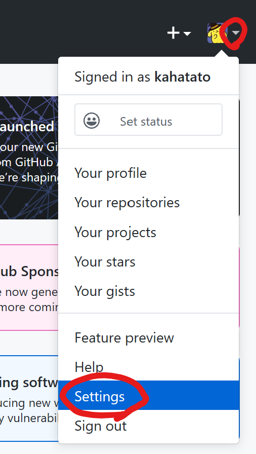
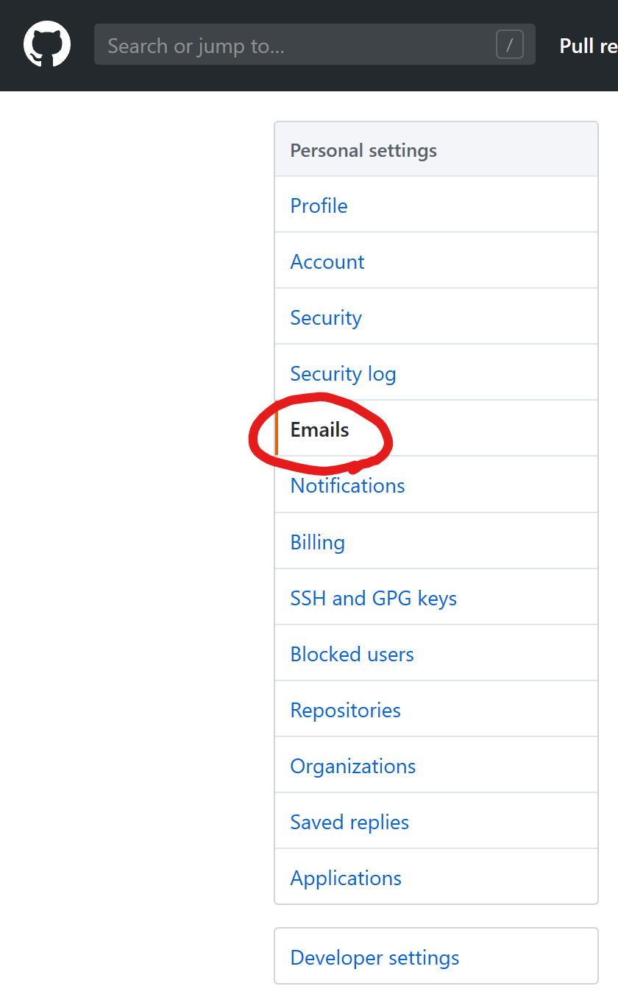
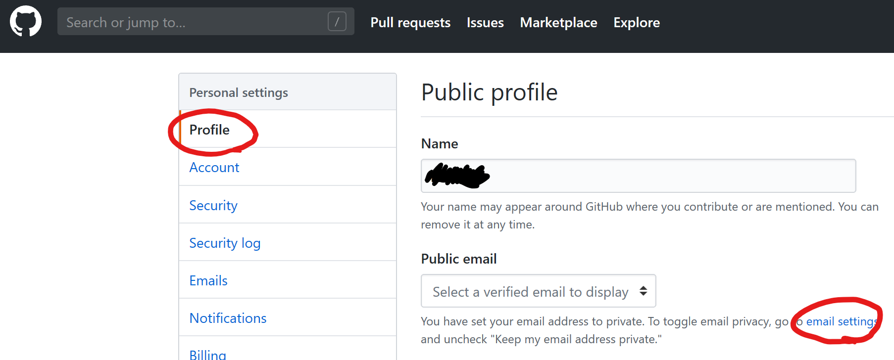
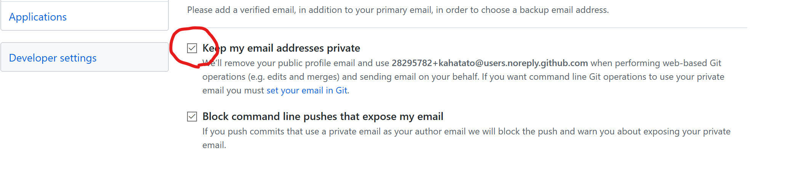

## メールアドレスを非公開にする
1. 設定画面へ遷移する\
    
1. メール設定画面へ遷移する
    \
    または、
    
1. 設定

1. ローカルの設定
    ```
    # 設定を確認
    git config --global --list
    # user.emailが登録されていたら、削除
    git config --global --unset user.email
    # noreply設定
    git config --global --add user.email my-github-user-name@users.noreply.github.com
    ```
## こんなときは。。。
### すでにコミット済みのログを修正したい
1. ログを修正したブランチで以下のコマンドを実行
    ```
    git filter-branch -f --env-filter "GIT_AUTHOR_NAME='kahatato'; GIT_AUTHOR_EMAIL='my-github-user-name@users.noreply.github.com'; GIT_COMMITTER_NAME='kahatato'; GIT_COMMITTER_EMAIL='my-github-user-name@users.noreply.github.com';" HEAD
    ```
### エラー内容
```
warning: {設定項目} has multiple values
error: cannot overwrite multiple values with a single value
```
### 対処法
{設定項目}を`.gitconfig`から削除する
```
# 設定ファイルをVimで開く
vim ~/.gitconfig
# 挿入モードに切り替え
i
# コマンドモードに切り替え
Esc
# 上書き保存して閉じる
:wq
```

https://pages.github.com/
https://jekyllrb.com/