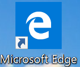

# **Markdown(マークダウン)とは**  
文章の書き方の一手段。  デジタル文書を活用する方法として考案された。  
Markdownのメリットは以下の通り。  
1. 手軽に文章構造を明示できる  
1. 簡単で、覚えやすい  
1. 読み書きに特別なアプリを必要としない  
1. 対応アプリを使えば快適に読み書きできる  
    - pdfやhtmlに変換する機能など便利なものがある。 

近年、様々な団体が独自の仕様を追加し、発展している。  
その内、VSCodeは、**CommonMark**の仕様を採用している。  
Markdownの細かい仕様については以下を参照する。  
|サイト名|URL|
|:--|:--|
|CommonMarkのサイト|<https://commonmark.org/>|
|Markdownチュートリアル|<https://commonmark.org/help/tutorial/>|
|日本語Markdownユーザー会|http://www.markdown.jp/|

# **表示サンプル**  
# 見出し  
## 見出し2  
### 見出し3  
#### 見出し4  
##### 見出し5  
###### 見出し6  
# 文字装飾 
*斜体*  
_斜体_  
**太字**  
__太字__  
***斜体太字***  
___斜体太字___  
~~取り消し線~~  
<font color="Red">赤色</font>  
# 改行  
改行1\
改行1\
改行2  
改行2  
# リスト  
- リスト  
    - リストネスト1  
        - リストネスト1-2  
    - リストネスト2  
        - リストネスト2-2  
- リスト  
- リスト  
# 番号付リスト  
1. 番号付きリスト  
    1. 番号付きリストネスト1  
        1. 番号付きリストネスト1-1  
    1. 番号付きリストネスト2  
        1. 番号付きリストネスト2-1  
1. 番号付きリスト  
1. 番号付きリスト  
# 引用  
> 引用  
> 引用  
>> 引用ネスト  
>> 引用ネスト  
# リンク  
[リンク名](https://www.google.co.jp/)  
# オートリンク  
<https://www.google.co.jp/>  
# 参照リンク  
[リンク名]:https://www.google.co.jp/  
[参照リンク][リンク名]
[参照リンク2][リンク名]
# 画像リンク  
  
# ページ内リンク
[見出し](#見出し)
[見出し2](##見出し2)
[見出し3](###見出し3)
[見出し4](####見出し4)
[見出し5](#####見出し5)
[見出し6](######見出し6)
[リスト](#リスト)
[番号付リスト](#番号付リスト)
[引用](#引用)
[リンク](#リンク)
[画像リンク](#画像リンク)
[水平線](#水平線)
[表組み](#表組み)
[code記法](#code記法)
[pre記法](#pre記法)
[pre記法(シンタックスハイライト)](#pre記法(シンタックスハイライト))  
# 水平線  
***  
---  
___  
# 表組み  
|ヘッダー1|ヘッダー2|ヘッダー3|
|:--|--:|:--:|
|左寄せ|右寄せ|中央揃え|
|123|aaa|あああ|
# code記法  
コードは `hoge hoge hoge` です  

# pre記法  
## タブまたは半角スペース4つ
    public class Hoge {
        public static void main(String[] args){
            System.out.println("Hoge");
        }
    }
## チルダ  
~~~
public class Hoge2 {
    public static void main(String[] args){
        System.out.println("Hoge2");
    }
}
~~~
## バッククォート    
```
public class Hoge3 {
    public static void main(String[] args){
        System.out.println("Hoge3");
    }
}
```
# pre記法(シンタックスハイライト)
~~~java
public class Hoge {
    public static void main(String[] args){
        System.out.println("Hoge");
    }
}
~~~

# エスケープ  
\# マークダウン記法を無効  

# 記法一覧
|用途|記法|記入例|表示|補足|
|:--|:--|:--|:--|:--|
|コード（インライン)|\`コード\`|\`サンプル\`|`サンプル`||
|ページ内リンク|\[リンク名](#リンク先)|\[リンク名](#リンク先)|[リンク名](#リンク先)|`#リンク先`には見出しを指定する|
|外部リンク|リンク先フルパス|`https://www.google.co.jp/`|https://www.google.co.jp/|URLのみ|
|外部リンク(リンク名で表示)|\[リンク名](リンク先フルパス)|\[google](`https://www.google.co.jp/`)|[google](https://www.google.co.jp/)||
|外部リンク(リンク名で表示)|\[リンク名](リンク先フルパス)|\[サンプルページ](./sample/sample.md)|[サンプルページ](./sample/sample.md)||
|画像表示|\!\[画像名](ファイ名フルパス)|\!\[サンプル](./img/sample.png)||
# 改行
`\` または `  ` (半角スペース2つ)
# マークダウンの特殊文字([※特殊文字一覧](#特殊文字一覧))を無効にする
`\`(バックスラッシュ)
# 特殊文字一覧
|文字|読み|
|:--|:--|
|\*|アスタリスク|
|\_|アンダースコア|
|\\\|バックスラッシュ|
|\`|バッククオート|
|\#|シャープ|
|\+|プラス|
|\-|マイナス|
|\.|ドット|
|\!|エクスクラメーションマーク|
|\[]|角括弧|
|\{}|中括弧|
|\()|丸括弧|
# リンク集
|サイト名|URL|補足|
|:--|:--|:--|
|公式サイト|https://commonmark.org/||
|記法|https://commonmark.org/help/||
|チュートリアル|https://commonmark.org/help/tutorial/||
|日本語Markdownユーザー会|https://www.markdown.jp/||
